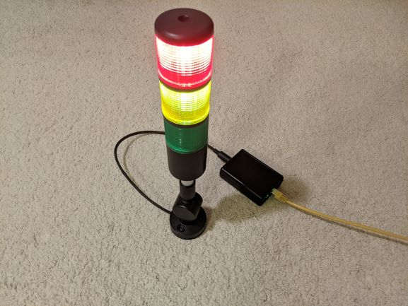

POE Stack Light Firmware
=======================

The [POE stack light][blog-post] is a network controlled status indication light that is powered over the network using POE.

This repository contains the firmware for the ESP32 processor, the [PCB designs][hardware-repo] and [documentation and build guide][documentation-repo] can be found in their respective git repositories.

Firmware functionality
----------------------

The firmware provides two control methods a HTTP interface or by using the [Art-Net][Art-Net] lighting protocol.
The HTTP interface allows for control or configuration of the light by a user via a web browser as well as control by automation scripts.
Art-Net is used to control the device from theatrical lighting consoles and other similar systems.
Documentation on how to use both methods can be found in the user guide in the [documentation repository][documentation-repo].

Note on Device IDs
------------------

The compiled firmware images and source code use a development and testing ESTA manufacturer id. This is fine if you are using the units yourself but if distributing the units then you will need to apply for an ESTA manufacturer ID and replace the one included in the firmware. More details are provided in the product_ids.h file.

[blog-post]: https://www.scorpia.co.uk/2021/05/23/building-a-poe-enabled-lighting-fixture/
[hardware-repo]: https://github.com/Tyler-Ward/stacklight-hardware
[documentation-repo]: https://github.com/Tyler-Ward/stacklight-documentation
[Art-Net]: https://art-net.org.uk/resources/art-net-specification/
